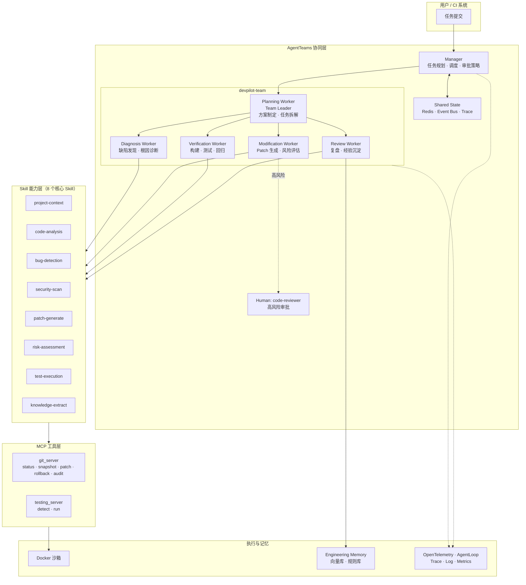

# DevPilot Infra

[](https://github.com/amskle/devpilot-infra/actions/workflows/ci.yml)
[](LICENSE)
[](pyproject.toml)
[](#测试)

> 面向软件研发全生命周期的多 Agent 协同优化基础设施。以 **AgentTeams** 为协同设计基点，覆盖项目理解、缺陷发现、根因分析、优化规划、安全修改、自动验证、经验沉淀与能力进化。

DevPilot Infra 将"缺陷发现 → 优化规划 → 安全修改 → 自动验证 → 复盘沉淀"固化为八环节闭环，通过 6 个 Agent 分工协作、8 个 Skill 提供可复用能力、2 个 MCP Server 接入工程工具链，在高风险修改上实现分级审批、自动回滚与全链路审计。

## 系统架构



## Agent 分工

| Agent | 角色 | 职责 | 调用 Skill |
|-------|------|------|-----------|
| Manager | Supervisor | 任务规划、调度、审批策略 | — |
| Planning Worker | Team Leader | 方案制定、任务分解、历史方案检索 | project-context |
| Diagnosis Worker | Worker | 项目理解、缺陷发现、根因诊断 | code-analysis · bug-detection · security-scan |
| Modification Worker | Worker | Patch 生成、风险分级、安全修改 | patch-generate · risk-assessment |
| Verification Worker | Worker | 构建、单元测试、回归验证 | test-execution |
| Review Worker | Worker | 复盘总结、经验提取、规则生成 | knowledge-extract |

## Skill 目录

| Skill | 功能 | 复用价值 |
|-------|------|---------|
| `project-context` | 项目类型识别、技术栈提取、构建工具检测 | 任意项目接入的通用入口 |
| `code-analysis` | AST 解析、依赖图构建、复杂度分析 | 语言无关的代码理解基座 |
| `bug-detection` | 规则匹配 + 启发式缺陷检测 | 可插拔规则集，支持自定义 |
| `security-scan` | 硬编码密钥、注入、配置泄露检测 | 安全合规基线扫描 |
| `patch-generate` | 结构化 Diff 生成、冲突预检 | 非 LLM 确定性补丁引擎 |
| `risk-assessment` | Low / Medium / High 风险分级 | 分级审批策略的判定核心 |
| `test-execution` | 测试发现、沙箱执行、结果收集 | 语言无关的验证执行器 |
| `knowledge-extract` | Problem/Solution Pattern 提取 | 经验沉淀与能力进化引擎 |

## 快速开始

### 前置条件

- Python 3.10+
- AgentTeams（Docker 部署，仅 AgentTeams 模式需要）

### 本地模式（无需 Docker）

```powershell
pip install -e ".[dev]"
python runtime/pipeline.py --repo demo/sample_python --approval auto --output-dir out/demo
```

本地模式直接调用 Skill 完成"诊断 → 规划 → 修改 → 验证 → 复盘"闭环，不依赖 Docker。运行报告输出到 `out/demo/report.md`，示例证据见 `docs/examples/`。

### AgentTeams 模式

```powershell
# 1. 确认平台状态
docker exec hiclaw-controller hiclaw status

# 2. 应用 Agent 声明式资源
docker cp agentteams/workers hiclaw-controller:/tmp/workers
docker exec hiclaw-controller sh -c "for f in /tmp/workers/*.yaml; do hiclaw apply -f `"$f`"; done"
docker exec hiclaw-controller hiclaw apply -f agentteams/team.yaml
docker exec hiclaw-controller hiclaw apply -f agentteams/human.yaml

# 3. 构建 Skill 包并上传为 Worker package
.\scripts\build-worker-package.ps1

# 4. 注册 MCP Server 到 Higress 网关
docker exec hiclaw-controller hiclaw apply -f mcp/git_server.py
docker exec hiclaw-controller hiclaw apply -f mcp/testing_server.py
```

当前已验证环境：模型 `qwen3.7-flash`（DashScope 兼容模式）经 Higress AI 网关调用返回 HTTP 200；Manager `default`、5 个 Worker 全部 Running、Team `devpilot-team` Active、Human `code-reviewer` Active。Element Web 访问 `http://127.0.0.1:18088`。

## 项目结构

```text
agentteams/       AgentTeams 声明式资源（Manager / 5 Worker / Team / Human）
skills/           8 个核心 Skill（metadata + executor + tests）
mcp/              MCP Server（Git / Testing）
shared_state/     共享状态与事件模型（schema + store）
runtime/          本地编排管线（状态机、审批、报告）
demo/             Python / Spring Boot 示例场景
docs/             设计、安全、部署、合规、测试文档 + 运行证据
scripts/          构建、部署辅助脚本
tests/            端到端冒烟测试
```

## 测试

```powershell
python -m pytest skills tests -q
```

测试覆盖 8 个 Skill 执行器、本地端到端闭环、失败自动回滚，当前 12 项全部通过。详细说明见 [docs/testing.md](docs/testing.md)。

## 运行证据

`docs/examples/` 包含 Python 与 Spring Boot 两个示例的完整运行报告：

- [sample-python-report.md](docs/examples/sample-python-report.md)：检测 mutable-default-argument、bare-except、hardcoded-secret，自动修复 2 项，验证通过
- [sample-spring-report.md](docs/examples/sample-spring-report.md)：Spring Boot 场景诊断报告

`docs/evidence/` 提供度量指标与 Trace 样本结构，用于复赛评估对齐。

## 参赛对齐

| 赛题要求 | 本项目落点 |
|---------|-----------|
| AgentTeams 必选协同基点 | Manager + 5 Worker + Team + Human 全量声明并部署 |
| ≥3 个职能 Agent | 6 个 Agent（1 Manager + 5 Worker） |
| Skill 必选 | 8 个核心 Skill，含 metadata / executor / tests |
| MCP 推荐工具连接层 | 2 个 MCP Server（Git / Testing），Higress 网关注册 |
| 高风险修改审批/回滚/审计 | 分级审批 + 自动回滚 + 全链路 Trace |
| 开源计划 | Apache-2.0，Skill 可独立复用 |

详细合规披露见 [docs/compliance.md](docs/compliance.md)。

## 合规与披露

本项目以 AgentTeams 为多 Agent 协同设计基点；Skill 为必选项，MCP 为工具连接层；高风险代码修改采用分级审批、自动回滚与全链路审计。第三方依赖、商业 API、闭源模型、数据来源与授权边界见 [docs/compliance.md](docs/compliance.md)。

## 贡献

欢迎提交 Issue 和 Pull Request。参与方式见 [CONTRIBUTING.md](CONTRIBUTING.md)。

## 许可证

[Apache License 2.0](LICENSE)
