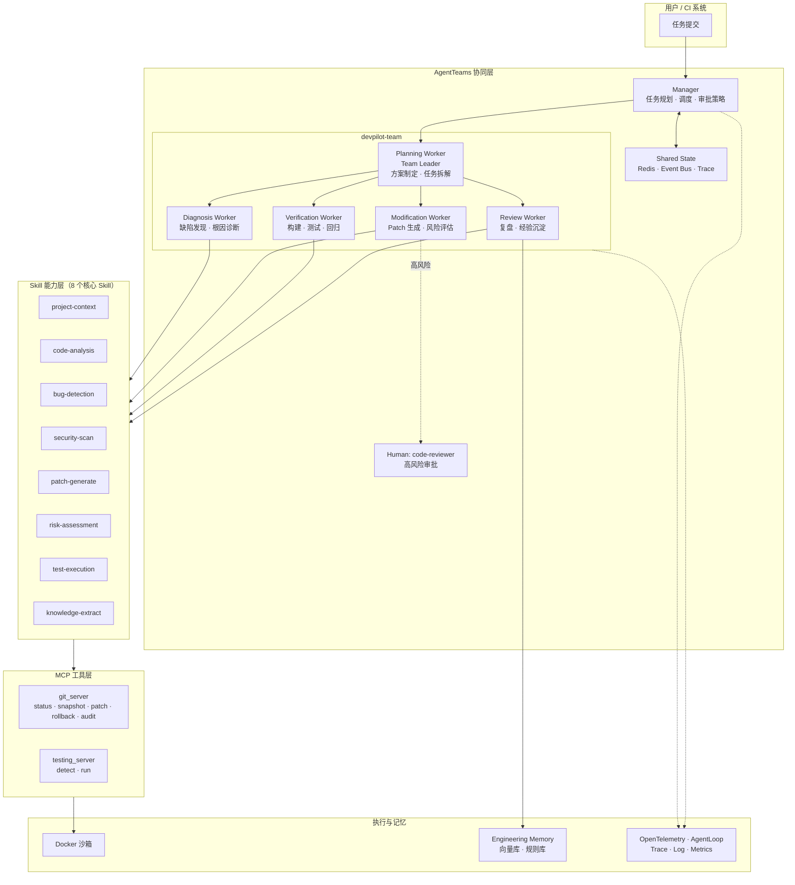

# DevPilot Infra

[](https://github.com/amskle/devpilot-infra/actions/workflows/ci.yml)
[](LICENSE)
[](pyproject.toml)
[](#测试)

> 以 **LangGraph** 为唯一工作流编排器、以 DevPilot Agent Runtime 为受控智能执行层的软件研发 Agent 平台。

# 重构流程
### Phase 0：执行契约与 ADR

- LangGraph 唯一编排、自研 Agent Runtime 的架构决策记录。
- Node 输入输出、状态、错误和预算语义。
- Workspace 隔离、审批边界和恢复规范。
- MVP/生产存储映射及模型、Checkpoint 适配方案。
- 完成并验收以下 ADR：
  - [ADR-0001：AgentRunner 工具循环](docs/adr/0001-agent-runner-tool-loop.md)
  - [ADR-0002：GraphState 初始化与 Reducer](docs/adr/0002-graph-state-initialization-and-reducers.md)
  - [ADR-0003：ChangeRequest 与 ReplanRequest](docs/adr/0003-change-request-and-replan-request.md)
  - [ADR-0004：ModelGateway 结构化输出](docs/adr/0004-model-gateway-structured-output.md)
  - [ADR-0005：工具错误与重试边界（已被 ADR-0007 替代）](docs/adr/0005-tool-error-and-retry-boundaries.md)
  - [ADR-0006：Chat 与控制操作边界](docs/adr/0006-chat-and-control-boundaries.md)
  - [ADR-0007：工具级重试统一由 ToolExecutor 执行](docs/adr/0007-tool-executor-retry-ownership.md)

### Phase 1：最小可靠运行时

- LangGraph 主流程和轻量 Agent Runtime。
- 原有 8 个 Skill 适配。
- SQLite Checkpoint、本地 Artifact Store。
- 每任务独立 Git worktree。
- Patch 生成、风险判断、CLI 审批、应用和验证闭环。
- 最大迭代、失败路由、回滚补偿和恢复测试。

### Phase 2：Plan 与 Replanning

- 结构化、版本化 Plan。
- ReplanRequest 和 Planning Agent 复用。
- Plan 原子切换和审计。

### Phase 3：可靠事件

- Event Store / Outbox 先写、Redis Streams 后发。
- 游标补拉、脱敏、WebSocket 基础和完整 Trace。

### Phase 4：FastAPI 与 Human-in-the-loop

- 任务、审批、取消、回滚、恢复和事件 API。
- 认证、授权、幂等和并发控制。

### Phase 5：Vue3 前端

- Dashboard、Task Detail、Timeline、Diff、测试报告。
- 风险审批、人工介入、恢复操作和 ChangeRequest。

### Phase 6：分层记忆

- PostgreSQL 结构化记忆。
- 开发环境必须使用 Milvus Lite，生产可替换为 Milvus。
- 将历史 Bug Pattern 向量化写入 Semantic Memory，并保留可追溯的来源引用。
- Diagnosis 开始前检索相似历史问题；前端展示命中的历史经验、相似度和来源。
- 按策略检索、Token 限制、来源标注和 Prompt Injection 防护。

### Phase 7：Replay 与评测

- Event Replay、State Replay。
- RecoveryPoint Fork / Re-run。
- 评测集、指标和模型/Prompt 对比。

---

当前 Phase 0+1 已实现 plain-dict GraphState、SQLite Checkpoint、独立 Git worktree、四类 LLM Agent、唯一 ToolExecutor、Patch 风险审批、确定性验证、有限失败路由、补偿回滚、CLI 暂停恢复和脚本化 Fake Model 测试。原 AgentTeams 声明与 MCP Server 仅作为迁移资料保留，不进入新运行时执行链。

## 当前系统架构

```text
CLI
  → TaskService
  → LangGraph（流程、条件路由、Interrupt、Checkpoint、预算）
  → DevPilot Agent Runtime（Prompt、模型、有限 Tool Loop、Schema 校验）
  → ToolExecutor（白名单、路径、重试、预算）
  → 8 个 Skill / Git Worktree / Test Execution
  → SQLite Control Projection + Event Store / Artifact Store
```

详细执行契约见 [docs/phase1-execution-contract.md](docs/phase1-execution-contract.md)，架构决策见 [docs/adr/](docs/adr/)。

## Legacy AgentTeams 架构资料

下图描述的是原比赛提交资产，不是当前默认运行时。



## Legacy Agent 分工

| Agent | 角色 | 职责 | 调用 Skill |
|-------|------|------|-----------|
| Manager | Supervisor | 任务规划、调度、审批策略 | — |
| Planning Worker | Team Leader | 方案制定、任务分解、历史方案检索 | project-context |
| Diagnosis Worker | Worker | 项目理解、缺陷发现、根因诊断 | code-analysis · bug-detection · security-scan |
| Modification Worker | Worker | Patch 生成、风险分级、安全修改 | patch-generate · risk-assessment |
| Verification Worker | Worker | 构建、单元测试、回归验证 | test-execution |
| Review Worker | Worker | 复盘总结、经验提取、规则生成 | knowledge-extract |

## Skill 目录

| Skill | 功能 | 复用价值 |
|-------|------|---------|
| `project-context` | 项目类型识别、技术栈提取、构建工具检测 | 任意项目接入的通用入口 |
| `code-analysis` | AST 解析、依赖图构建、复杂度分析 | 语言无关的代码理解基座 |
| `bug-detection` | 规则匹配 + 启发式缺陷检测 | 可插拔规则集，支持自定义 |
| `security-scan` | 硬编码密钥、注入、配置泄露检测 | 安全合规基线扫描 |
| `patch-generate` | 结构化 Diff 生成、冲突预检 | 非 LLM 确定性补丁引擎 |
| `risk-assessment` | Low / Medium / High 风险分级 | 分级审批策略的判定核心 |
| `test-execution` | 测试发现、沙箱执行、结果收集 | 语言无关的验证执行器 |
| `knowledge-extract` | Problem/Solution Pattern 提取 | 经验沉淀与能力进化引擎 |

## 快速开始

### 前置条件

- Python 3.10+
- Git 2.30+
- 真实模型模式需要 OpenAI-compatible Chat Completions 端点

### 本地模式（无需 Docker）

```powershell
python -m venv .venv
.\.venv\Scripts\python -m pip install -r requirements.lock
.\.venv\Scripts\python -m pip install --no-deps -e .

$env:DEVPILOT_MODEL_API_KEY = "..."
$env:DEVPILOT_MODEL_BASE_URL = "https://your-compatible-endpoint/v1"
$env:DEVPILOT_MODEL = "your-model"
python -m devpilot task create --repo C:\path\to\clean-git-repo --request "修复失败测试"
```

源仓库必须是干净 Git 根目录。DevPilot 在用户数据目录中创建隔离 clone/worktree，绝不直接修改源工作树。可用 `python -m devpilot --help` 查看审批、拒绝、取消、回滚、恢复和对账命令。

旧 `runtime/pipeline.py` 仍是兼容入口，但只转发到上述 LangGraph 后端。

### Legacy AgentTeams 资料

```powershell
# 1. 确认平台状态
docker exec hiclaw-controller hiclaw status

# 2. 应用 Agent 声明式资源
docker cp agentteams/workers hiclaw-controller:/tmp/workers
docker exec hiclaw-controller sh -c "for f in /tmp/workers/*.yaml; do hiclaw apply -f `"$f`"; done"
docker exec hiclaw-controller hiclaw apply -f agentteams/team.yaml
docker exec hiclaw-controller hiclaw apply -f agentteams/human.yaml

# 3. 构建 Skill 包并上传为 Worker package
.\scripts\build-worker-package.ps1

# 4. 注册 MCP Server 到 Higress 网关
docker exec hiclaw-controller hiclaw apply -f mcp/git_server.py
docker exec hiclaw-controller hiclaw apply -f mcp/testing_server.py
```

当前已验证环境：模型 `qwen3.7-flash`（DashScope 兼容模式）经 Higress AI 网关调用返回 HTTP 200；Manager `default`、5 个 Worker 全部 Running、Team `devpilot-team` Active、Human `code-reviewer` Active。Element Web 访问 `http://127.0.0.1:18088`。

## 项目结构

```text
devpilot/         LangGraph、Agent Runtime、ToolExecutor、服务、CLI 与领域契约
agentteams/       Legacy AgentTeams 声明式资源（不进入新执行链）
skills/           8 个核心 Skill（metadata + executor + tests）
mcp/              MCP Server（Git / Testing）
shared_state/     共享状态与事件模型（schema + store）
runtime/          旧 API/CLI 兼容投影与报告
demo/             Python / Spring Boot 示例场景
docs/             设计、安全、部署、合规、测试文档 + 运行证据
scripts/          构建、部署辅助脚本
tests/            端到端冒烟测试
```

## 测试

```powershell
python -m pytest skills tests -q
```

测试覆盖 8 个 Skill、State 序列化、Fake Gateway、Tool 权限/重试、SQLite 对账、工作区隔离、审批过期、Checkpoint 恢复和端到端闭环，当前 37 项全部通过。详细说明见 [docs/testing.md](docs/testing.md)。

## 运行证据

`docs/examples/` 包含 Python 与 Spring Boot 两个示例的完整运行报告：

- [sample-python-report.md](docs/examples/sample-python-report.md)：检测 mutable-default-argument、bare-except、hardcoded-secret，自动修复 2 项，验证通过
- [sample-spring-report.md](docs/examples/sample-spring-report.md)：Spring Boot 场景诊断报告

`docs/evidence/` 提供度量指标与 Trace 样本结构，用于复赛评估对齐。

## 参赛对齐

| 赛题要求 | 本项目落点 |
|---------|-----------|
| AgentTeams 必选协同基点 | Manager + 5 Worker + Team + Human 全量声明并部署 |
| ≥3 个职能 Agent | 6 个 Agent（1 Manager + 5 Worker） |
| Skill 必选 | 8 个核心 Skill，含 metadata / executor / tests |
| MCP 推荐工具连接层 | 2 个 MCP Server（Git / Testing），Higress 网关注册 |
| 高风险修改审批/回滚/审计 | 分级审批 + 自动回滚 + 全链路 Trace |
| 开源计划 | Apache-2.0，Skill 可独立复用 |

详细合规披露见 [docs/compliance.md](docs/compliance.md)。

## 合规与披露

本项目当前以 LangGraph 为唯一状态机；AgentTeams/MCP 是保留的历史迁移资产。高风险代码修改采用绑定 Patch 的审批、隔离工作区、补偿回滚与结构化审计。第三方依赖、商业 API、闭源模型、数据来源与授权边界见 [docs/compliance.md](docs/compliance.md)。

## 贡献

欢迎提交 Issue 和 Pull Request。参与方式见 [CONTRIBUTING.md](CONTRIBUTING.md)。

## 许可证

[Apache License 2.0](LICENSE)
