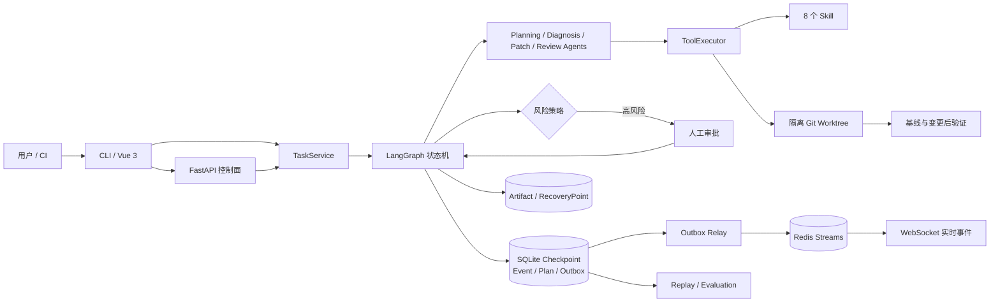

# DevPilot Infra

[](https://github.com/amskle/devpilot-infra/actions/workflows/ci.yml)
[](pyproject.toml)
[](pyproject.toml)
[](#项目状态)
[](LICENSE)

> **面向真实软件变更的安全工程 Agent：在隔离 Git 工作区中完成规划、诊断、修改、审批、验证、恢复与评测，并保留可重放的完整证据链。**

DevPilot Infra 是一个以 **LangGraph** 为唯一工作流编排器、以受控 Agent Runtime 为智能执行层的软件研发 Agent 平台。它不让模型直接、无边界地修改源仓库，而是把每次变更放入确定性的工程流程：先建立基线，再形成版本化计划，生成不可变 Patch，经风险策略或人工审批后应用，最后执行验证，并在失败时回滚。

当前版本为 **v0.7.0**，Phase 0–7 已全部完成。CLI、FastAPI 控制面、Vue 3 控制台、Redis 多 Worker 实时事件、Event/State Replay、RecoveryPoint Fork 与模型/Prompt 评测均已实现。

## 目录

- [为什么是 DevPilot](#为什么是-devpilot)
- [核心特性](#核心特性)
- [系统架构](#系统架构)
- [快速上手](#快速上手)
- [安装与依赖](#安装与依赖)
- [详细用法](#详细用法)
- [配置](#配置)
- [Phase 0–7 完成情况](#phase-07-完成情况)
- [项目结构](#项目结构)
- [测试与质量](#测试与质量)
- [文档导航](#文档导航)
- [常见问题](#常见问题)
- [贡献指南](#贡献指南)
- [许可证](#许可证)

## 为什么是 DevPilot

通用 Coding Agent 往往能够快速生成代码，却容易把关键工程责任留给使用者：修改是否发生在源工作树、模型是否越权调用工具、高风险变更由谁批准、进程中断后从哪里恢复，以及结果能否被审计和复现。

DevPilot 针对这些问题提供一套完整执行契约：

- **源仓库不被直接修改**：每个任务使用独立 clone/worktree 和 Workspace Lease。
- **模型不拥有无限权限**：Agent 只能通过带白名单、Schema、路径边界、重试和预算约束的 ToolExecutor 行动。
- **高风险操作必须显式决策**：审批绑定具体 Patch、基础版本和 State Revision，不能复用于其他修改。
- **状态与证据可以恢复**：SQLite Checkpoint、Event Store、Artifact Store 和 RecoveryPoint 共同构成可靠恢复链路。
- **结果可以比较而非只靠观感**：Replay 验证执行完整性，Evaluation 对同一数据集上的模型和 Prompt 进行指标化比较。

这使 DevPilot 更适合需要安全边界、人工介入、故障恢复、审计与可重复评测的研发自动化场景。

## 核心特性

- **端到端变更闭环**：基线测试 → Planning → Diagnosis → Patch Generation → Risk Assessment → Approval → Apply → Verification → Review。
- **安全隔离与恢复**：独立 Git worktree、路径边界、敏感区域拒绝、RecoveryPoint、失败补偿回滚和新 Run 恢复。
- **可审计的 Human-in-the-loop**：风险分级、Revision 乐观锁、幂等控制命令、审批过期、取消、回滚、恢复和正式 ChangeRequest。
- **可靠状态与实时事件**：LangGraph SQLite Checkpoint、持久 Event Store、Transactional Outbox、游标补拉、脱敏、Redis Streams 和只读 WebSocket。
- **完整操作界面**：CLI、带 OpenAPI 的 FastAPI 控制面，以及覆盖任务、Timeline、Diff、验证、审批和恢复的 Vue 3 控制台。
- **Replay 与评测**：无副作用 Event/State Replay、隔离 RecoveryPoint Fork、版本化数据集、Prompt Override、质量/Token/费用指标和报告对比。
- **8 个确定性 Skill**：项目识别、代码分析、缺陷检测、安全扫描、Patch 生成、风险评估、测试执行和知识提取。
- **OpenAI-compatible 模型接入**：支持兼容 Chat Completions 的模型端点，并对结构化输出提供多级兼容回退。

## 系统架构



持久事实以 SQLite Event Store、LangGraph Checkpoint 和内容寻址 Artifact 为准；Redis 仅负责跨 Worker 的短期安全状态、限流和实时事件传输。更完整的模块边界见 [系统架构](docs/architecture.md)。

## 快速上手

以下流程可在 Windows PowerShell 中直接执行。开始前请准备：

- Python 3.10 或更高版本；
- Git 2.30 或更高版本；
- 一个 OpenAI-compatible Chat Completions 端点及 API Key；
- 一个**干净的 Git 仓库根目录**作为任务目标。

### 1. 安装

```powershell
git clone https://github.com/amskle/devpilot-infra.git
cd devpilot-infra
python -m venv .venv
.\.venv\Scripts\python -m pip install -r requirements.lock
.\.venv\Scripts\python -m pip install --no-deps -e .
```

### 2. 配置模型

```powershell
$env:DEVPILOT_MODEL_API_KEY = "your-api-key"
$env:DEVPILOT_MODEL_BASE_URL = "https://your-compatible-endpoint/v1"
$env:DEVPILOT_MODEL = "your-model"
```

`DEVPILOT_MODEL_BASE_URL` 可省略，此时使用 OpenAI SDK 的默认服务地址。API Key 只从环境变量读取，不会写入 GraphState、Event 或 Artifact。

### 3. 创建第一个任务

```powershell
.\.venv\Scripts\python -m devpilot task create `
  --repo C:\path\to\clean-git-repo `
  --request "修复失败测试，并补充最小回归用例"
```

DevPilot 会同步推进任务，直到完成、失败或需要人工介入。输出是完整的 JSON GraphState，关键字段类似：

```json
{
  "task_id": "task_...",
  "run_id": "run_...",
  "status": "WAITING_RISK_APPROVAL",
  "state_revision": 7,
  "active_plan_ref": { "plan_id": "plan_...", "version": 1 },
  "pending_approval": {
    "approval_id": "approval_...",
    "patch_hash": "...",
    "base_revision": "..."
  }
}
```

如果无需修改，状态通常为 `COMPLETED_NO_CHANGES`；自动允许的低风险修改验证通过后为 `COMPLETED`；需要人工决策时为 `WAITING_RISK_APPROVAL`。

### 4. 查看状态与计划

```powershell
.\.venv\Scripts\python -m devpilot task list
.\.venv\Scripts\python -m devpilot task status --task-id TASK_ID
.\.venv\Scripts\python -m devpilot task plan --task-id TASK_ID
```

至此已经完成一次最小体验。DevPilot 的所有运行数据默认存放在 `~/.devpilot`，目标源仓库保持不变，实际修改位于任务的隔离工作区中。

## 安装与依赖

### 后端开发环境

Windows PowerShell：

```powershell
python -m venv .venv
.\.venv\Scripts\python -m pip install -r requirements.lock
.\.venv\Scripts\python -m pip install --no-deps -e .
```

Linux / macOS：

```bash
python3 -m venv .venv
.venv/bin/python -m pip install -r requirements.lock
.venv/bin/python -m pip install --no-deps -e .
```

锁定依赖包含 LangGraph、SQLite Checkpoint、FastAPI、Pydantic、OpenAI SDK、Redis Client、Uvicorn 和 Pytest。Python 3.10 与 3.13 均由 CI 验证。

### 前端开发环境

Vue 3 控制台需要 Node.js 22（CI 基准）和 npm：

```powershell
cd frontend\vue3
npm ci
npm run dev
```

### 可选基础设施

- **Redis**：仅生产环境或多 Uvicorn Worker 部署必需；本地单 Worker 开发可不启用。
- **Docker Compose**：用于当前 FastAPI、Vue 3、Nginx 和 Redis 的一键部署。
- **AgentTeams / MCP**：只作为 Legacy 迁移资产保留，不属于当前默认执行链。

### Docker Compose 快速部署

当前前后端可以通过 Nginx、FastAPI 和 Redis 的 Compose 拓扑统一启动。默认只在
`127.0.0.1:8080` 暴露 Nginx，API 和 Redis 不直接发布宿主端口。

```powershell
Copy-Item .env.docker.example .env
# 编辑 .env：至少替换仓库根目录、模型 API Key 和长随机 API Token
docker compose up --build --wait -d
```

Linux / macOS：

```bash
cp .env.docker.example .env
# 编辑 .env 后启动
docker compose up --build --wait -d
```

打开 <http://127.0.0.1:8080>，在控制台中输入 `.env` 配置的 API Token。创建任务时
必须填写容器内路径，例如 `/repos/my-project`，不能填写宿主的
`C:\repos\my-project`。宿主仓库根目录通过 `DEVPILOT_REPOSITORY_ROOT_HOST` 只读挂载到
容器的 `/repos`。

默认的 `DEVPILOT_TOOLCHAIN_PROFILE=python` 镜像只包含 Python、pytest 和 Git；将其改为
`full` 后重新构建，会额外加入 Node.js、JDK、Maven、Gradle、Go 和 Rust。镜像不会自动
安装目标仓库依赖，目标项目仍需具备可直接运行的测试环境或 wrapper。

```bash
docker compose logs -f api nginx redis
docker compose down                 # 保留任务数据
docker compose down -v              # 警告：永久删除任务数据卷
```

完整配置、安全边界、备份和升级方法见 [部署指南](docs/deployment.md)。

## 详细用法

### 启动 API 与 Web 控制台

终端 1，启动本地 API：

```powershell
.\.venv\Scripts\python -m devpilot api --host 127.0.0.1 --port 8000
```

预期启动信息包含：

```text
Uvicorn running on http://127.0.0.1:8000
```

健康检查：

```powershell
curl.exe http://127.0.0.1:8000/api/health
```

预期输出：

```json
{"status":"ok","service":"devpilot-api"}
```

本地开发还可打开：

- Swagger UI：<http://127.0.0.1:8000/docs>
- ReDoc：<http://127.0.0.1:8000/redoc>
- Readiness：<http://127.0.0.1:8000/api/ready>

终端 2，启动前端：

```powershell
cd frontend\vue3
npm ci
npm run dev
```

打开 <http://127.0.0.1:5173>，在右上角“访问凭证”中输入本地开发 Token `devpilot-local`。该默认管理员 Token 只允许用于回环地址上的开发环境，任何共享环境都必须替换。

### 审批或拒绝高风险 Patch

先从 `task status` 输出读取 `pending_approval`、`patch_hash`、`base_revision` 和当前 `state_revision`，再提交绑定决策：

```powershell
.\.venv\Scripts\python -m devpilot task approve `
  --task-id TASK_ID `
  --approval-id APPROVAL_ID `
  --patch-hash PATCH_HASH `
  --base-revision BASE_REVISION `
  --expected-revision STATE_REVISION
```

将 `approve` 换成 `reject` 即可拒绝。CLI 会自动生成并打印幂等 Key；自动化调用可通过 `--idempotency-key` 显式传入。

### 取消、重规划与恢复

```powershell
# 取消尚未结束的任务
.\.venv\Scripts\python -m devpilot task cancel `
  --task-id TASK_ID --expected-revision STATE_REVISION

# 人工介入后提交显式重规划原因
.\.venv\Scripts\python -m devpilot task replan `
  --task-id TASK_ID `
  --expected-revision STATE_REVISION `
  --reason "原计划假设不成立，需要调整实现路径"

# 从恢复点创建新的 Run
.\.venv\Scripts\python -m devpilot task restore `
  --task-id TASK_ID --recovery-point-id RECOVERY_POINT_ID

# 修复 Task 投影与持久 Checkpoint 之间的不一致
.\.venv\Scripts\python -m devpilot admin reconcile --task-id TASK_ID
```

`rollback` 在当前任务上执行 Revision 绑定的回滚；`restore` 创建新的 Run；Phase 7 的 `replay fork` 则从恢复点建立完全隔离的新 Task。

### Event 与 State Replay

只读 Replay 不调用模型、不执行工具，也不修改源任务：

```powershell
.\.venv\Scripts\python -m devpilot replay events --task-id TASK_ID
.\.venv\Scripts\python -m devpilot replay state --task-id TASK_ID
.\.venv\Scripts\python -m devpilot replay history --task-id TASK_ID
```

指定历史范围：

```powershell
.\.venv\Scripts\python -m devpilot replay events `
  --task-id TASK_ID --run-id RUN_ID --through-sequence 20

.\.venv\Scripts\python -m devpilot replay state `
  --task-id TASK_ID --run-id RUN_ID --state-revision 4
```

从 RecoveryPoint Fork 并重新运行会实际调用模型和工具，因此会消耗预算：

```powershell
.\.venv\Scripts\python -m devpilot replay fork `
  --task-id TASK_ID `
  --recovery-point-id RECOVERY_POINT_ID `
  --model candidate-model
```

### 模型与 Prompt 评测

评测数据集支持 YAML 或 JSON：

```yaml
name: python-no-change
version: "1"
cases:
  - case_id: clean-python
    repo: C:\repos\sample
    request: inspect repository
    revision: HEAD
    expectation:
      statuses: [COMPLETED_NO_CHANGES]
      changed_files: []
      requires_approval: false
```

运行、查询和比较：

```powershell
.\.venv\Scripts\python -m devpilot eval run --dataset dataset.yaml --model model-a
.\.venv\Scripts\python -m devpilot eval list
.\.venv\Scripts\python -m devpilot eval show --evaluation-id EVALUATION_ID
.\.venv\Scripts\python -m devpilot eval compare `
  --baseline BASELINE_EVALUATION_ID `
  --candidate CANDIDATE_EVALUATION_ID
```

评测报告记录状态准确率、验证准确率、审批准确率、Changed Files precision/recall/F1、Token 和费用。只有 `dataset_digest` 相同的报告可以比较。

Prompt Override 是 Agent ID 到完整 instructions 的 YAML/JSON 映射：

```yaml
planning: Create a minimal plan with explicit rollback criteria.
diagnosis: Diagnose only from deterministic repository evidence.
```

```powershell
.\.venv\Scripts\python -m devpilot eval run `
  --dataset dataset.yaml `
  --prompt-version candidate-v2 `
  --prompt-overrides prompts-v2.yaml
```

### CLI 命令总览

```text
devpilot api
devpilot task create|list|status|plan|approve|reject|cancel|rollback|restore|resume|replan
devpilot admin reconcile
devpilot replay events|state|history|fork
devpilot eval run|show|list|compare
```

使用 `python -m devpilot <group> <command> --help` 查看具体参数。

## 配置

| 环境变量 | 作用 | 默认值 | 何时必填 |
|---|---|---|---|
| `DEVPILOT_MODEL_API_KEY` | OpenAI-compatible 模型凭据 | 无 | 创建、恢复、Fork 或评测等需要模型的操作 |
| `DEVPILOT_MODEL_BASE_URL` | 模型服务基础地址 | OpenAI SDK 默认地址 | 使用兼容端点时 |
| `DEVPILOT_MODEL` | 默认模型名称 | `gpt-5-mini` | 否 |
| `DEVPILOT_DATA_DIR` | Control DB、Checkpoint、Artifact 和 worktree 根目录 | `~/.devpilot` | 否 |
| `DEVPILOT_ENV` | API 环境名称 | `development` | 生产建议设为 `production` |
| `DEVPILOT_API_TOKENS` | Token 到主体、管理员及任务创建权限的 JSON 映射；生产 Token 至少 32 字符 | 开发环境使用 `devpilot-local` | 非开发环境或非回环监听 |
| `DEVPILOT_API_REPOSITORY_ROOTS` | API 可创建任务的仓库根目录 JSON 数组 | 空；此时仅管理员可创建 | 普通 API 用户创建任务 |
| `DEVPILOT_API_CORS_ORIGINS` | 允许的 Origin，逗号分隔 | 空 | 前后端跨域部署时 |
| `DEVPILOT_REDIS_URL` | Redis/Redis TLS URL | 无 | 非开发环境或多 Worker |
| `DEVPILOT_REDIS_KEY_PREFIX` | 票据、限流和 Stream 命名空间 | `devpilot` | 否 |
| `DEVPILOT_EVENT_TICKET_TTL_SECONDS` | WebSocket 单次票据有效期 | `30` | 否 |
| `DEVPILOT_RELAY_POLL_SECONDS` | Outbox Relay 空闲轮询间隔 | `0.25` | 否 |
| `DEVPILOT_API_WORKERS` | API Worker 数量校验值 | `1` | CLI 会根据 `--workers` 自动设置 |
| `VITE_API_BASE_URL` | Vue 3 控制台的 API 前缀 | `/api` | 前端独立部署时 |

通过 API 创建任务会运行仓库自身的测试/构建命令，因此属于特权操作：管理员默认拥有该权限；非管理员主体必须在 Token 映射中显式设置 `"task_creator": true`，并同时配置 `DEVPILOT_API_REPOSITORY_ROOTS`。未授权主体仍可查询和控制自己已有的任务。

生产或多 Worker 示例：

```powershell
$env:DEVPILOT_ENV = "production"
$env:DEVPILOT_API_TOKENS = '{"replace-with-long-random-token":{"subject":"operator-1","admin":true}}'
$env:DEVPILOT_API_REPOSITORY_ROOTS = '["C:\\repos"]'
$env:DEVPILOT_API_CORS_ORIGINS = "https://devpilot.example.com"
$env:DEVPILOT_REDIS_URL = "redis://127.0.0.1:6379/0"

.\.venv\Scripts\python -m devpilot api `
  --host 0.0.0.0 --port 8000 --workers 4
```

多 Worker 必须共享同一个 `DEVPILOT_DATA_DIR`。Redis 不可用时，readiness、票据和限流采取 fail-closed；已持久化任务与事件不会丢失，Outbox 会在 Redis 恢复后继续投递。

## Phase 0–7 完成情况

### 项目状态

| Phase | 交付内容 | 状态 | 说明 |
|---:|---|:---:|---|
| 0 | 执行契约与 ADR | ✅ | LangGraph 唯一编排、GraphState/DTO 边界、工具循环、重试、审批与恢复决策 |
| 1 | 最小可靠运行时 | ✅ | SQLite Checkpoint、隔离 worktree、基线测试、4 类 Agent、Patch/审批/验证/回滚闭环 |
| 2 | Plan 与 Replanning | ✅ | 版本化 Plan、ReplanRequest、自动/人工重规划和原子切换 |
| 3 | 可靠事件 | ✅ | Event Store、Transactional Outbox、Redis Streams 适配、游标补拉、脱敏与 Trace |
| 4 | FastAPI 控制面 | ✅ | Bearer 认证、任务授权、OpenAPI、幂等/并发控制、REST/WebSocket 与 ChangeRequest |
| 5 | Vue 3 控制台 | ✅ | Dashboard、任务详情、Timeline、Diff、验证报告、审批、人工介入与恢复操作 |
| 6 | 分布式控制面 | ✅ | Redis 单次票据、跨 Worker 限流、自动 Outbox Relay、readiness 与故障语义 |
| 7 | Replay 与评测 | ✅ | Event/State Replay、RecoveryPoint Fork、评测数据集、Prompt 对比与指标报告 |

项目当前处于 **Phase 0–7 功能完成、持续维护与增强** 状态。版本化执行契约和各阶段验收边界见 [阶段文档](#文档导航)。

## 项目结构

```text
devpilot/          活跃运行时：CLI、API、领域模型、服务、LangGraph、Agent 与工具执行
frontend/vue3/     Vue 3 + TypeScript 控制台
skills/            8 个确定性 Skill 及其测试
tests/             运行时、状态机、API、分布式控制面和 Replay/Evaluation 测试
docs/              架构、安全、部署、测试、ADR 与 Phase 1–7 契约
demo/              Python 与 Spring Boot 示例场景
runtime/           旧入口的兼容转发层
shared_state/      兼容事件与共享状态模型
agentteams/        Legacy AgentTeams 声明资产，不进入默认执行链
mcp/               Legacy Git / Testing MCP 资产
```

活跃执行路径是 `devpilot/`、`skills/`、`frontend/vue3/` 与 `tests/`。`agentteams/` 和 `mcp/` 仅作为历史比赛资产及迁移参考保留。

## 测试与质量

后端完整测试：

```powershell
.\.venv\Scripts\python -m pytest skills tests -q
```

前端类型检查、组件测试和生产构建：

```powershell
cd frontend\vue3
npm ci
npm run typecheck
npm test
npm run build
```

CI 在 Python 3.10、Python 3.13 和 Node.js 22 上执行。测试覆盖 8 个 Skill、GraphState/Pydantic 边界、模型 Fake Gateway、工具权限与重试、预算、SQLite 对账、工作区隔离、审批、恢复、版本化 Plan、可靠事件、FastAPI 安全契约、Redis 多 Worker、Vue 控制绑定以及 Phase 7 Replay/Evaluation。详细范围见 [测试手册](docs/testing.md)。

## 文档导航

| 文档 | 内容 |
|---|---|
| [系统架构](docs/architecture.md) | 活跃运行时模块边界、持久层与兼容层 |
| [Phase 1 执行契约](docs/phase1-execution-contract.md) | State、Checkpoint、审批、失败路由、预算与基线验证 |
| [Phase 2 Plan 与 Replanning](docs/phase2-plan-replanning.md) | Plan 版本、ReplanRequest 与原子切换 |
| [Phase 3 可靠事件](docs/phase3-reliable-events.md) | Event Store、Outbox、游标、顺序、脱敏与 Trace |
| [Phase 4 FastAPI 控制面](docs/phase4-fastapi-control-plane.md) | REST/WebSocket、认证授权、幂等、错误和 ChangeRequest |
| [Phase 5 Vue 3 前端](docs/phase5-vue3-frontend.md) | 控制台能力、API 契约与前端验证 |
| [Phase 5 UI 设计](docs/phase5-ui-design-prototype.md) | 信息架构、主题、响应式与可访问性设计 |
| [Phase 6 分布式控制面](docs/phase6-distributed-control-plane.md) | Redis、多 Worker、一致性与故障语义 |
| [Phase 7 Replay 与评测](docs/phase7-replay-evaluation.md) | 重放、Fork、数据集、指标和 Prompt 对比 |
| [ADR 索引](docs/adr/README.md) | 关键架构决策及其状态 |
| [部署指南](docs/deployment.md) | 本地、API、分布式与 Legacy 部署方式 |
| [安全边界](docs/security.md) | 审批、隔离、凭据、回滚、Replay 与评测安全 |
| [合规披露](docs/compliance.md) | 第三方依赖、模型、数据和授权边界 |
| [Skill 清单](docs/skill-list.md) | 8 个 Skill 的输入、输出和适用范围 |

## 常见问题

### DevPilot 会直接修改我传入的仓库吗？

不会。源仓库必须是干净的 Git 根目录，DevPilot 在数据目录中创建隔离 clone/worktree，并在该工作区内应用 Patch 和运行验证。

### 为什么任务停在 `WAITING_RISK_APPROVAL`？

风险策略判定该 Patch 需要人工批准。请检查 Diff、验证证据和 `pending_approval`，然后通过 Web 控制台、API 或 Revision 绑定的 CLI 命令批准或拒绝。审批不能绕过路径或安全策略的硬拒绝。

### 没有模型 API Key 可以做什么？

CLI 帮助、已有任务查询、只读 Event/State Replay 和静态文档不需要模型调用。创建任务、恢复执行、RecoveryPoint Fork 和评测运行需要有效的模型凭据。

### 本地开发必须安装 Redis 吗？

不需要。单 Worker、回环地址、`development` 环境可使用进程内票据和限流。生产环境或 `--workers` 大于 1 时必须配置 Redis。

### 支持哪些项目？

当前基线测试与验证链路覆盖 Python、Maven 和 npm 项目；8 个 Skill 中部分能力是语言无关的。无法可靠识别测试命令时，任务会保留证据并进入受控失败或人工介入路径，而不是猜测执行。

### 数据保存在哪里？

默认位于 `~/.devpilot`，包括 `control.sqlite`、`checkpoints.sqlite`、Artifact 和隔离工作区。可通过 `--data-dir` 或 `DEVPILOT_DATA_DIR` 修改。

### Legacy AgentTeams 和 MCP 仍是主架构吗？

不是。自 v0.2 起，LangGraph 是唯一编排器；`agentteams/` 和 `mcp/` 只保留为迁移背景和历史资产，不进入默认执行链。

## 贡献指南

欢迎通过 Issue 和 Pull Request 参与。请先阅读 [CONTRIBUTING.md](CONTRIBUTING.md)，并遵循以下基本约定：

- Python 代码遵循 PEP 8，公开函数提供类型标注；
- 新增 Skill 必须包含 `metadata.yaml`、`executor.py`、`SKILL.md` 和对应测试；
- 状态转换必须确定性，并在 Pydantic 边界校验外部数据；
- Commit 使用 Conventional Commits；
- 提交前运行后端完整测试，以及涉及前端时的 typecheck、test 和 build。

## 许可证

本项目采用 [Apache License 2.0](LICENSE) 许可证。
